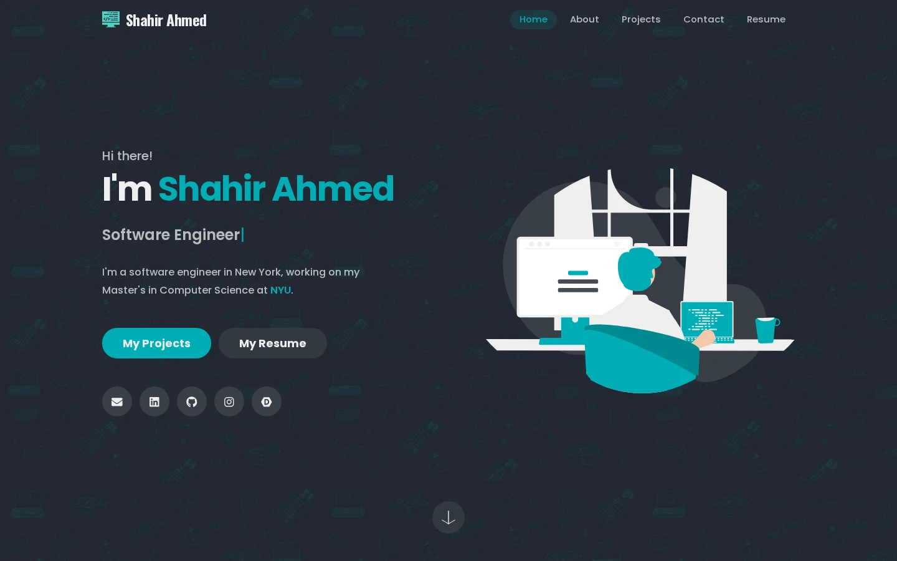
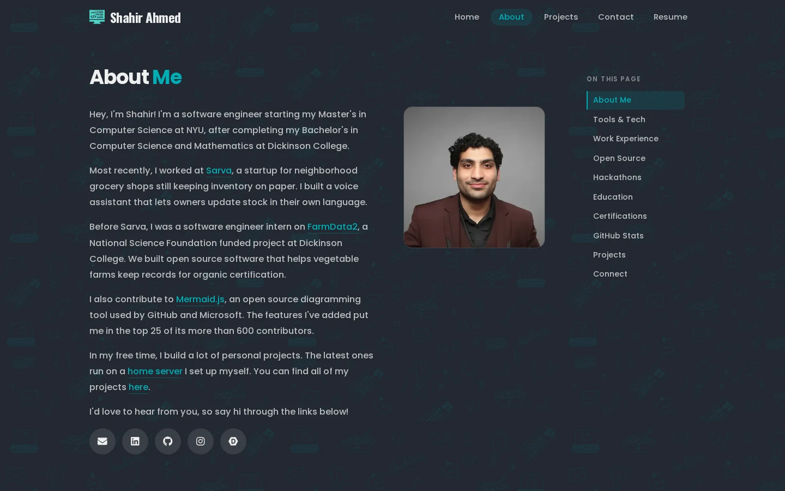
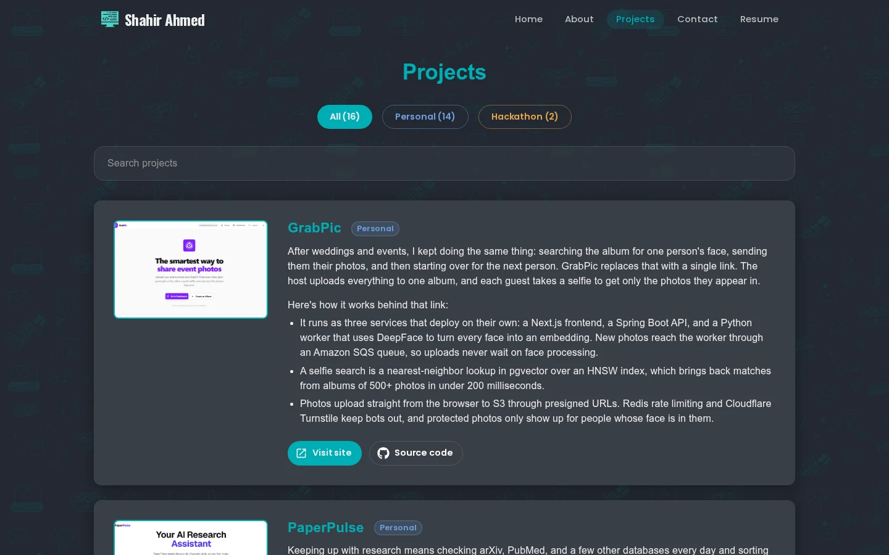
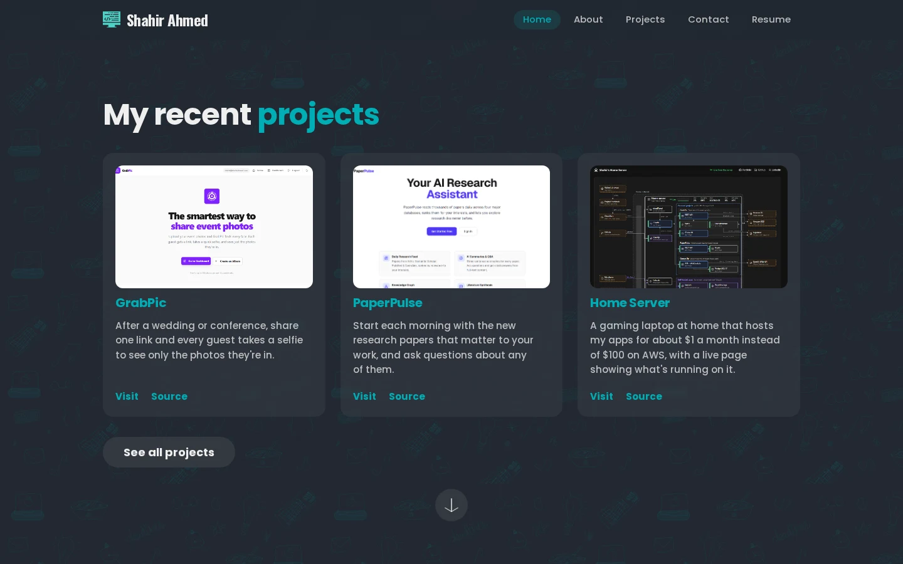
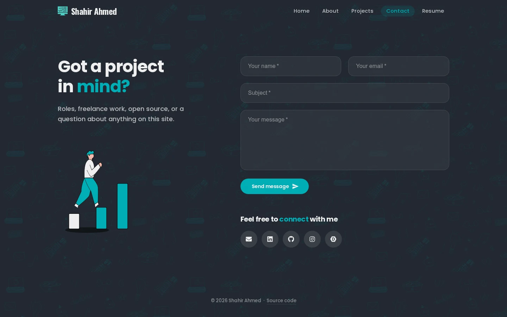
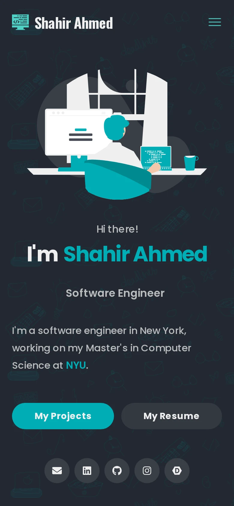
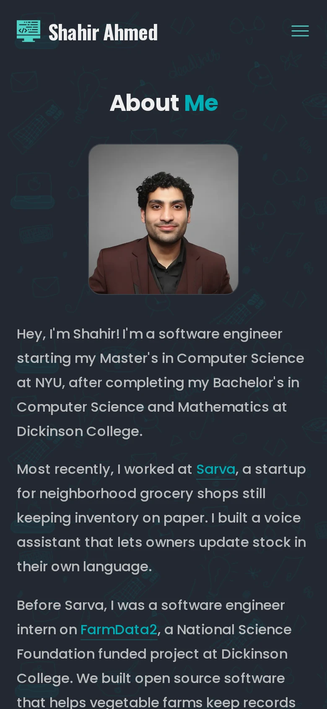
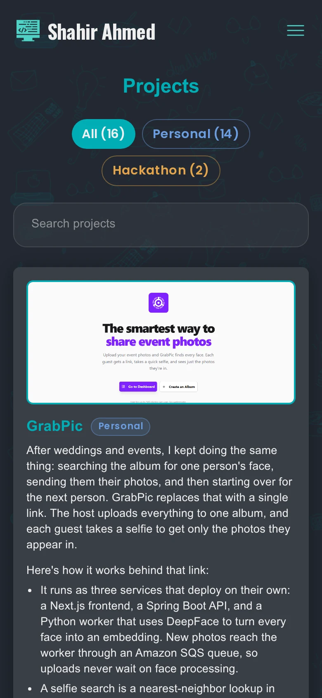

# shahirahmed.com

The code behind [shahirahmed.com](https://www.shahirahmed.com), my personal website. I'm a software engineer starting my Master's in Computer Science at NYU, and I built this site to share my projects and experience in one place.



<br />

## Contents

- [What's on the site](#whats-on-the-site)
- [Screenshots](#screenshots)
  - [Desktop](#desktop)
  - [Mobile](#mobile)
- [Built with](#built-with)
- [Under the hood](#under-the-hood)
  - [Search engines and AI assistants](#search-engines-and-ai-assistants)
  - [Security and performance](#security-and-performance)
- [Project structure](#project-structure)
- [Running it locally](#running-it-locally)
- [Configuration](#configuration)
- [Deployment](#deployment)
- [Feedback](#feedback)
- [License](#license)
- [Contact](#contact)

<br />

## What's on the site

- **Home:** a short introduction, a preview of my background, and three featured projects.
- **About:** my work experience, open source contributions, hackathons, education, and GitHub activity. A sticky table of contents makes the long page easy to navigate.
- **Projects:** my personal and hackathon projects, with search, category filters, and links to each live demo and repository.
- **Contact:** a message form that sends straight to my inbox through EmailJS.
- **404:** a page not found screen with buttons back to the main pages.

<br />

## Screenshots

### Desktop

<br />

<table>
  <tbody>
    <tr>
      <th width="50%" align="center"><br />About<br /><br /></th>
      <th width="50%" align="center"><br />Projects<br /><br /></th>
    </tr>
  </tbody>
  <tbody>
    <tr>
      <td align="center"><br /><br /><br /></td>
      <td align="center"><br /><br /><br /></td>
    </tr>
  </tbody>
  <tbody>
    <tr>
      <th width="50%" align="center"><br />Featured projects<br /><br /></th>
      <th width="50%" align="center"><br />Contact<br /><br /></th>
    </tr>
  </tbody>
  <tbody>
    <tr>
      <td align="center"><br /><br /><br /></td>
      <td align="center"><br /><br /><br /></td>
    </tr>
  </tbody>
</table>

<br />

### Mobile

<br />

<table>
  <tbody>
    <tr>
      <th width="33%" align="center"><br />Home<br /><br /></th>
      <th width="33%" align="center"><br />About<br /><br /></th>
      <th width="33%" align="center"><br />Projects<br /><br /></th>
    </tr>
  </tbody>
  <tbody>
    <tr>
      <td align="center"><br /><br /><br /></td>
      <td align="center"><br /><br /><br /></td>
      <td align="center"><br /><br /><br /></td>
    </tr>
  </tbody>
</table>

<br />

## Built with

<table>
  <tbody>
    <tr>
      <th align="left">Area</th>
      <th align="left">Tools</th>
    </tr>
  </tbody>
  <tbody>
    <tr>
      <td>Framework</td>
      <td>Next.js 15 (App Router), React 18</td>
    </tr>
  </tbody>
  <tbody>
    <tr>
      <td>UI</td>
      <td>Material UI 6, custom CSS, React Icons</td>
    </tr>
  </tbody>
  <tbody>
    <tr>
      <td>Fonts</td>
      <td>Poppins and Oswald through <code>next/font</code></td>
    </tr>
  </tbody>
  <tbody>
    <tr>
      <td>Illustrations</td>
      <td>SVG artwork exported from Figma</td>
    </tr>
  </tbody>
  <tbody>
    <tr>
      <td>Animation</td>
      <td>Typed.js, React Vertical Timeline</td>
    </tr>
  </tbody>
  <tbody>
    <tr>
      <td>GitHub activity</td>
      <td>React GitHub Calendar</td>
    </tr>
  </tbody>
  <tbody>
    <tr>
      <td>Contact form</td>
      <td>EmailJS</td>
    </tr>
  </tbody>
  <tbody>
    <tr>
      <td>Analytics</td>
      <td>Vercel Analytics and Speed Insights</td>
    </tr>
  </tbody>
  <tbody>
    <tr>
      <td>Hosting</td>
      <td>Vercel</td>
    </tr>
  </tbody>
</table>

<br />

## Under the hood

### Search engines and AI assistants

- Every page is statically generated with its own title, description, canonical URL, and social preview tags.
- JSON-LD structured data describes me as a `Person` with my occupation, credentials, and skills. It also lists each page and marks every project as `SoftwareSourceCode`.
- Social preview images are generated at the edge with `next/og`.
- `sitemap.xml` and `robots.txt` are generated from code, and `robots.txt` explicitly allows crawlers such as GPTBot, ClaudeBot, and PerplexityBot.
- [`/llms.txt`](https://www.shahirahmed.com/llms.txt) and [`/llms.json`](https://www.shahirahmed.com/llms.json) give AI assistants a readable summary and a structured copy of my profile, experience, and projects.
- A web app manifest and an OpenSearch description are included too.

### Security and performance

- Every response carries security headers, including HSTS with preload, `X-Frame-Options: DENY`, and a `Permissions-Policy` that blocks camera, microphone, and location access.
- Static assets are cached for a year, responses are compressed, and the `X-Powered-By` header is turned off.
- Images below the fold load lazily. The home page animations are skipped for visitors who have reduced motion turned on.
- The bare domain redirects to `www`, and `/resume` redirects to my latest resume.

<br />

## Project structure

```plaintext
├── docs/screenshots/         # Images used in this README
├── public/
│   ├── .well-known/          # AI plugin manifest
│   ├── figma/                # Illustrations and the doodle background
│   ├── llms.txt, llms.json   # Profile for AI assistants
│   └── manifest.json, opensearch.xml, openapi.yaml, humans.txt
├── src/
│   ├── app/
│   │   ├── layout.jsx        # Site-wide metadata and JSON-LD
│   │   ├── page.jsx          # Home
│   │   ├── about/            # About page and its metadata
│   │   ├── projects/         # Projects page and its metadata
│   │   ├── contact/          # Contact page and its metadata
│   │   ├── not-found.jsx     # 404
│   │   ├── robots.js, sitemap.js
│   │   └── opengraph-image.jsx, twitter-image.jsx
│   ├── assets/               # Logos and project images
│   ├── components/           # Page sections, artwork, navbar, footer
│   └── css/                  # Global styles
├── next.config.js            # Headers and redirects
└── vercel.json               # Domain redirect, headers, and caching
```

<br />

## Running it locally

You'll need Node.js 18.18 or newer.

```bash
git clone https://github.com/Shahir-47/shahirahmed.com.git
cd shahirahmed.com
npm install
npm run dev
```

Then open [http://localhost:3000](http://localhost:3000).

To test a production build, run `npm run build` followed by `npm run start`.

<br />

## Configuration

The contact form uses EmailJS. To receive messages in your own inbox, replace `SERVICE_ID`, `TEMPLATE_ID`, and `PUBLIC_KEY` at the top of `src/components/ContactMe.jsx` with the values from your EmailJS account.

To verify the site in Google Search Console, set the `NEXT_PUBLIC_GOOGLE_SITE_VERIFICATION` environment variable to your verification code.

<br />

## Deployment

The site is hosted on Vercel, which builds and deploys every push to `main`. To host your own copy, import the repository into Vercel. It detects Next.js on its own, so no extra build settings are needed.

<br />

## Feedback

If you find a bug, a typo, or something that looks off on your device, please [open an issue](https://github.com/Shahir-47/shahirahmed.com/issues). I'd appreciate it.

<br />

## License

This project is released under the MIT License. If you use it as a starting point for your own site, please swap in your own content and give credit.

<br />

## Contact

- Website: [shahirahmed.com/contact](https://www.shahirahmed.com/contact)
- LinkedIn: [linkedin.com/in/shahir47](https://www.linkedin.com/in/shahir47/)
- GitHub: [@Shahir-47](https://github.com/Shahir-47)
- Email: [shahir.a@nyu.edu](mailto:shahir.a@nyu.edu)
